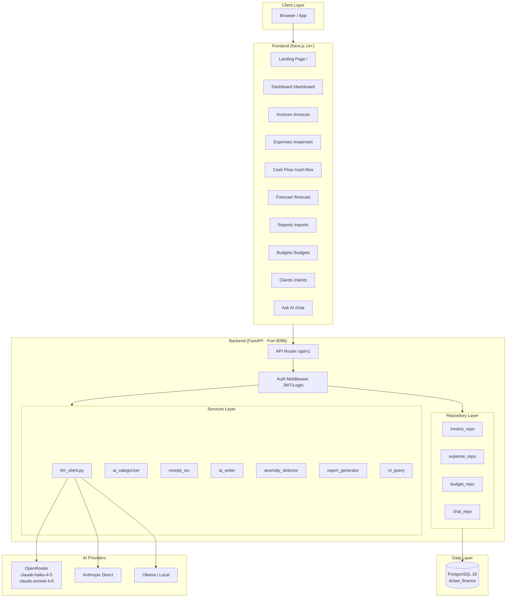
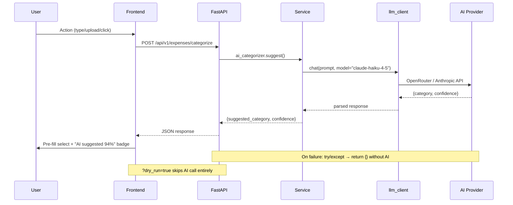
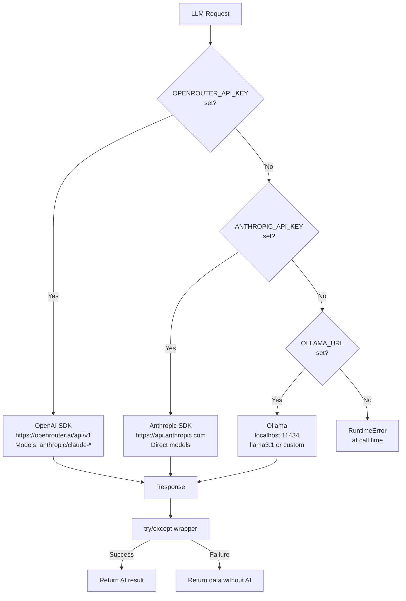
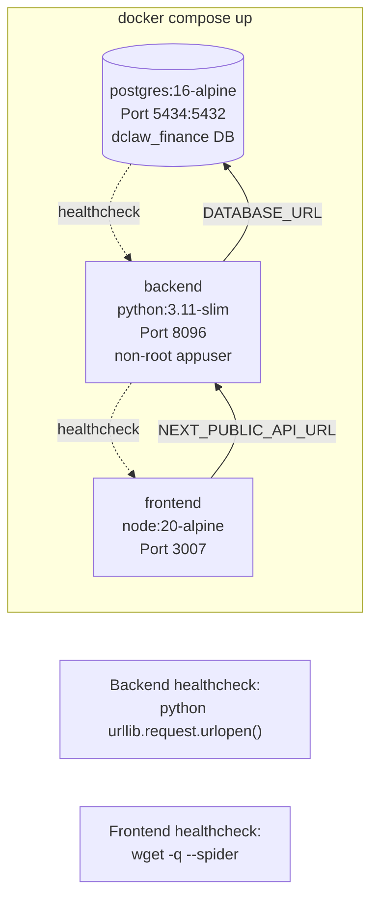
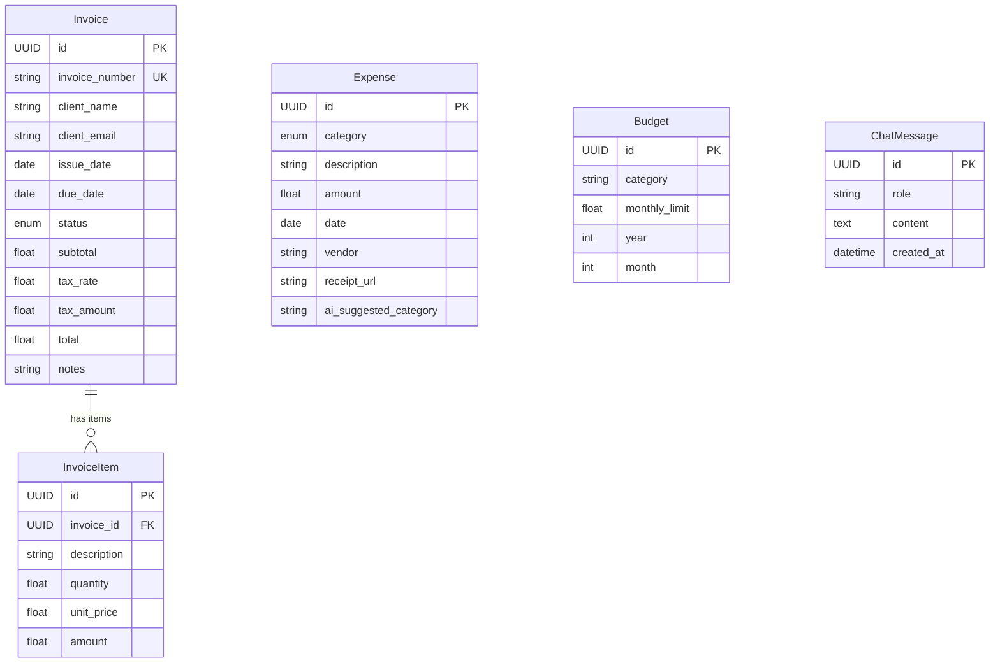
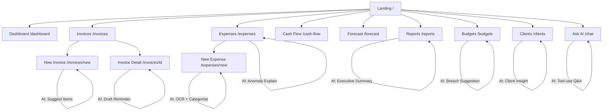

# DClaw Finance — Architecture Diagrams

> Source diagrams for infographic regeneration. Rendered with Mermaid.
> Version: 1.4 · Updated: 2026-05-31

---

## 1. System Architecture



---

## 2. AI Request Flow



---

## 3. Cash Flow Forecast Pipeline

```mermaid
flowchart LR
    subgraph Input["Historical Data (6 months)"]
        I1[Paid Invoice Totals\nfunc.sum by month]
        E1[Expense Totals\nfunc.sum by month]
    end

    subgraph Smoothing["Exponential Smoothing"]
        ES[α = 0.3\nSmoothed series]
        GR[Growth Rate\ncapped ±20%]
    end

    subgraph Output["3-Month Projection"]
        P1[Month+1\nRevenue · Expenses · Profit]
        P2[Month+2]
        P3[Month+3]
        CB[Confidence Band\n±10% of projected]
    end

    subgraph Extended["Extended Forecast Endpoints"]
        SC[/forecast/scenarios\n5 variants]
        TS[/forecast/three-statement\nIS + CF + BS]
        DR[/forecast/drivers\nClients · Win rate]
        SN[/forecast/sensitivity\n4-point table]
        MP[/forecast/mape\nAccuracy vs actuals]
    end

    I1 --> ES
    E1 --> ES
    ES --> GR
    GR --> P1 --> P2 --> P3
    P1 --> CB
    P3 --> Extended
```

---

## 4. LLM Provider Selection



---

## 5. Docker Compose Service Map



---

## 6. Data Model (Entity Relationships)



---

## 7. Screen Navigation Map



---

## 8. AI Feature Cost Map

| Feature | Model | Tokens | Caching |
|---------|-------|--------|---------|
| Expense categorisation | haiku-4-5 | ~50 | DB column `ai_suggested_category` |
| Receipt OCR | haiku-4-5 (vision) | ~1k | None |
| Invoice reminder draft | sonnet-4-6 | ~250 | None |
| Line-item suggestions | haiku-4-5 | ~200 | None |
| Anomaly explanations | haiku-4-5 | ~200 (batch) | 1h in-memory |
| Monthly report | sonnet-4-6 | ~1k | None |
| Budget breach suggestion | haiku-4-5 | ~150 | None |
| Client profitability insight | haiku-4-5 | ~300 (batch) | 24h in-memory |
| NL chat tool-use | sonnet-4-6 | ~500–2k | Chat history in DB |

All AI endpoints: `?dry_run=true` → mock response, zero token spend.
